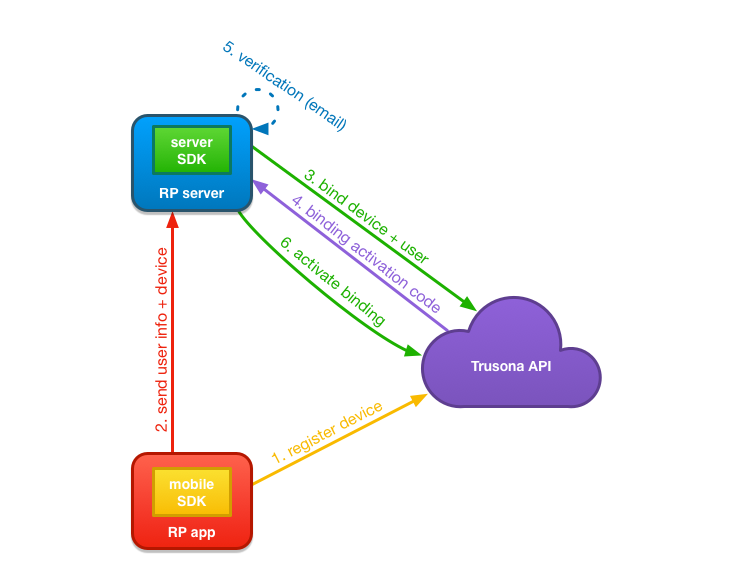
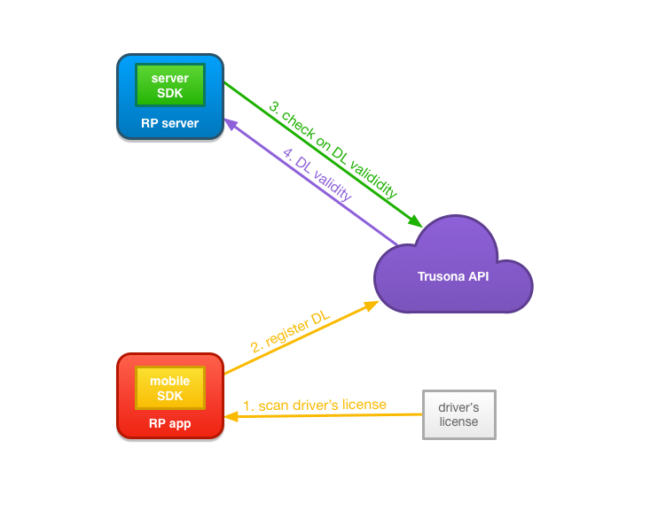
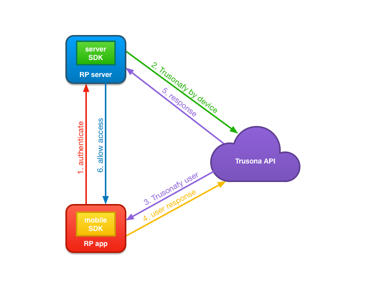
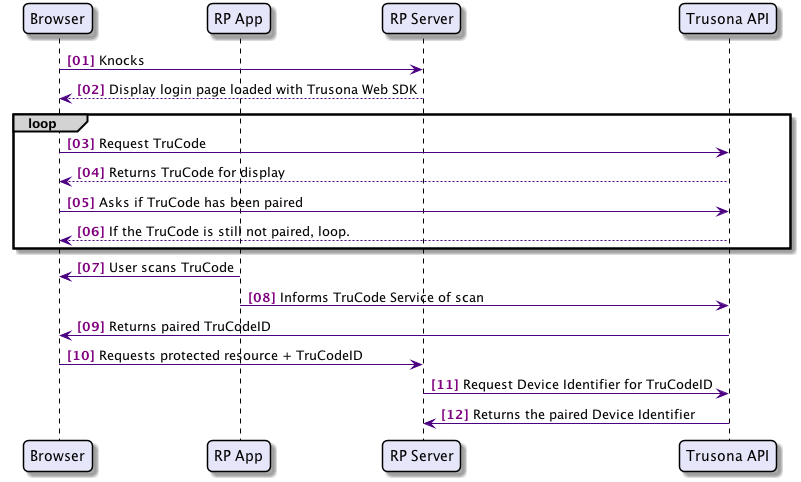
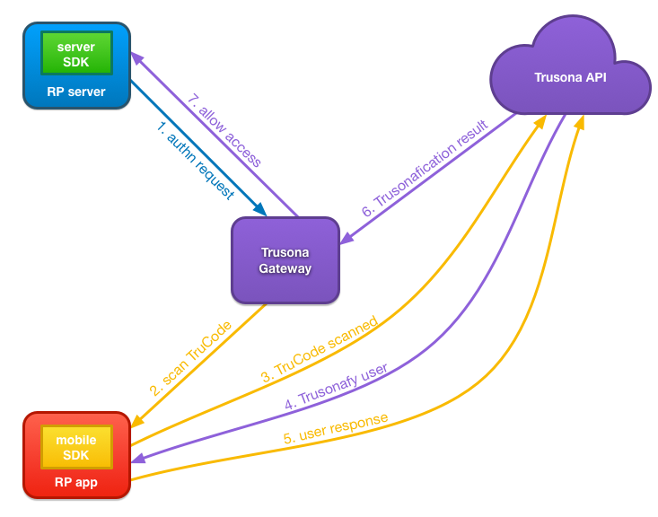
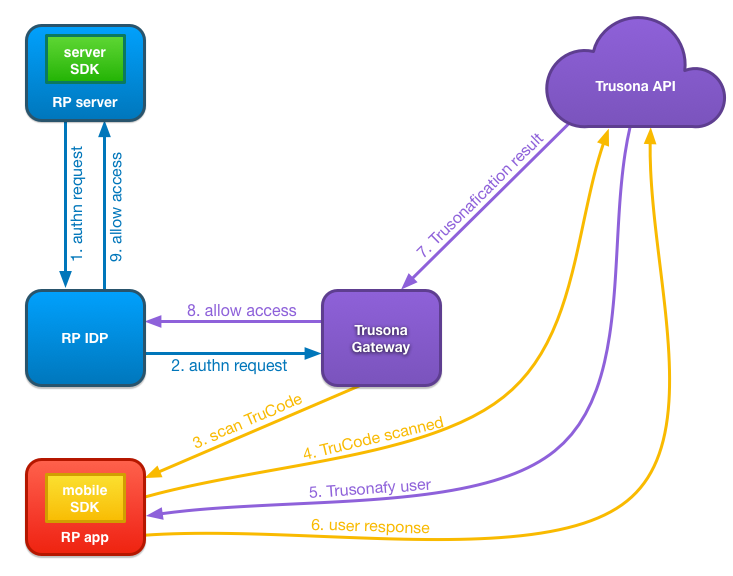
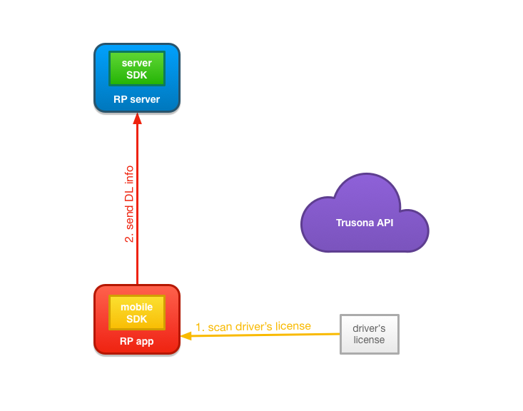

# Creating a #NoPasswords experience using the Trusona SDKs

## Table of contents

1. [Overview](#overview)
    1. [What replaces the password?](#what-replaces-the-password)
1. [Device and user registration use cases](#device-and-user-registration-use-cases)
    1. [A new user installs the app](#a-new-user-installs-the-app)
    1. [An existing user installs the app on a new device](#an-existing-user-installs-the-app-on-a-new-device)
    1. [An existing user gets updated to the new version of the app that uses the Trusona SDK](#an-existing-user-gets-updated-to-the-new-version-of-the-app-that-uses-the-trusona-sdk)
    1. [Upgrading a registered user to Executive](#upgrading-a-registered-user-to-executive)
1. [Authentication using Trusona use cases](#authentication-using-trusona-use-cases)
    1. [Trusonafying a registered user](#trusonafying-a-registered-user)
    1. [Scanning a displayed TruCode to bind to known device](#scanning-a-displayed-trucode-to-bind-to-known-device)
    1. [Trusonafying using SAML or OpenID Connect](#trusonafying-using-saml-or-openid-connect)
    1. [Trusonafying using SAML or OpenID Connect and an internal IDP](#trusonafying-using-saml-or-openid-connect-and-an-internal-idp)
1. [Identity document use cases](#identity-document-use-cases)
    1. [Scanning and parsing field data from a driver’s license barcode](#scanning-and-parsing-field-data-from-a-drivers-license-barcode)
1. [Glossary of Terms](#glossary-of-terms)

## Overview

**Note**: This article relies heavily on Trusona specific terms. Please familiarize yourself with the [Glossary of Terms](#glossary-of-terms) found at the end of this article before continuing.

To remove the need for your users to remember or use a password requires the collaboration of the following three components: your mobile app using the **Trusona Mobile SDK**, your backend systems and services, that require authentication, using the **Trusona Server SDK** and the **Trusona API** services themselves.

In this overview we will walk through the four most common use cases and how the three components work together to provide the #NoPassword experience for your users.

### What replaces the password?

Instead of a password, the **Trusona Mobile SDK** will create up to two private-public key pairs on the device. The first key pair represents the device key which Trusona uses to identify the device itself, and during the registration flow, will be bound to a user identifier. The second key pair, the auth key is used for a higher level of authentication where the user's presence is checked using the same OS security feature that is used to unlock the device.

The device key is supported on all devices that Trusona supports. It does not require that a hardware backed keystore is present on the device. For this reason, it is not considered as secure as a key created using a hardware backed keystore.

The auth key requires a hardware backed keystore to be created. This key is necessary to be able to check for user presence. If a device is unable to support this key, then the device and user will only be able to be authenticated with the most basic authentication level Trusona supports.

The private and public key pairs for both keys are created and stored on the device. The private keys never leave the device, but the public keys are sent to Trusona during the registration process. The **Trusona Mobile SDK** also derives the device identifier from the device key, which is the UUID used to interact with the **Trusona API** services.

It is the combination of these keys being bound with a user identifier that provide the secured credential that replaces the password.

### Device and user registration use cases

#### A new user installs the app

A new user wishes to use your company's services. They download the app on their device, and launch it.

1. Upon launching the app, the **Relying Party App** will request a device identifier from the **Trusona Mobile SDK**. The SDK will recognize that there are no keys present, so it will generate the device key and auth key (if it can) key pairs on the device, and send the public keys for each to the **Trusona API**. The **Trusona API** will create a device in an inactive state waiting for the remaining registration steps to complete before becoming active. The **Trusona Mobile SDK** will then make the device identifier available to the **Relying Party App** at any time it is requested.
2. The **Relying Party App** collects the user's primary information and sends that along with the device identifier, retrieved in step 1, to the **Relying Party Server**. The primary information  would be anything the Relying Party wants to store related to the user such as email address, name, phone etc.
3. The **Relying Party Server**, using the **Trusona Server SDK**, creates a device+user binding in the **Trusona API** by sending the user identifier along with the device identifier obtained in step 2.
4. The **Trusona API** responds to the device+user binding request with an activation code that the Relying Party will use to notify the **Trusona API** when the Account Verification step is complete.
5. The Relying Party completes the Account Verification process. This will likely include an email verification process.
6. Using the activation code obtained in step 4, the **Trusona Server SDK** notifies the **Trusona API** that the device+user binding has been verified and should be considered “active.”

With all the steps completed, there is now a new user with a fully bound device at Trusona. This new user is now available to respond to Trusonafication requests by the Relying Party.

#### An existing user installs the app on a new device

An existing user downloads your app on a new device, and launches it.

1. The **Trusona Mobile SDK** registers the device with the **Trusona API**.
2. The **Relying Party App** collects the user’s primary information and sends that in addition to the device identifier from the **Trusona Mobile SDK** to the **Relying Party Server**.
3. The **Relying Party Server**, using the **Trusona Server SDK**, creates an additional device+user binding in the **Trusona API** by sending the user identifier along with the device identifier obtained in step 2.
4. The **Trusona API** responds to the device+user binding request with an activation code that the **Relying Party Server** will use to notify the **Trusona API** when the Account Verification step is complete.
5. The Relying Party completes the Account Verification process. This will likely include an email verification process.
6. The Trusona Server SDK notifies the Trusona API that the device+user binding has been verified and should be considered “active.”

With all the steps completed, the user now has the new device associated to their account. This new device is usable by the user to respond to Trusonafication requests by the Relying Party.

#### An existing user gets updated to the new version of the app that uses the Trusona SDK

An existing user updates your app on their device, and launches it.

1. The **Trusona Mobile SDK** registers the device with the **Trusona API**.
2. The **Relying Party App** sends the **Relying Party Server** the device identifier so it can be bound to the existing user’s user identifier.
3. The **Relying Party Server**, using the **Trusona Server SDK**, creates a additional device+user binding in the **Trusona API** by sending the user identifier along with the device identifier obtained in step 2.
4. The **Trusona API** responds to the device+user binding request with an activation code that the Relying Party will use to notify the **Trusona API** when the Account Verification step is complete.
5. The Relying Party completes the Account Verification process. This will likely include an email verification process.
6. The **Trusona Server SDK** notifies the **Trusona API** that the device+user binding has been verified and should be considered “active.”

With all the steps completed, the user now has the new device associated to their account. This new device is usable by the user to respond to Trusonafication requests by the Relying Party.

#### Upgrading a registered user to Executive

Using the **Trusona Mobile SDK**, the **Relying Party App** can scan the user's driver's license and have it registered with Trusona as an identity document. The Relying Party can request an Executive level Trusonafication for users that have a registered driver's license, which will require the user to present their driver's license at the time of Trusonafication.

1. The **Relying Party App**, using the **Trusona Mobile SDK**, scans the barcode on the back of the user's driver's license. This returns the parsed fields from the driver's license information.
2. The **Relying Party App**, using the **Trusona Mobile SDK**, registers a driver's license payload with the **Trusona API**. The driver's license payload includes a hashed version of the raw driver's license barcode data and the parsed fields. The **Trusona API** does not persist the parsed fields, and only uses them to perform verifications with third-party verification services, such as AAMVA or LexisNexis, if the Relying Party is configured for this verification. Once the verification is done, the data is not kept. Trusona only persists the hash of the data for the purposes of checking for a match with a scanned driver's license during an Executive Trusonafication.
3. If the Relying Party is configured to have a verification done, the **Relying Party Server** can use the **Trusona Server SDK** to check on the validity of a user's registered driver's license.
4. The **Trusona API** will respond with the status of the verification.

### Authentication using Trusona use cases

#### Trusonafying a registered user

Your company wishes to challenge a user to accept or reject a specific action against a resource. (e.g. login to website)

1. **Relying Party App** attempts to authenticate with **Relying Party Server** by sending device identifier to **Relying Party Server**.
2. **Relying Party Server** users **Trusona Server SDK** to initiate the authentication flow by sending the device identifier received from the **Relying Party App** in step 1.
3. Trusona looks up the user bound to the received device identifier and issues a Trusonafication challenge to all devices bound to the user.
4. The **Trusona Mobile SDK** receives the Trusonafication, handles the Trusonafication flow and responds to the **Trusona API** with the user’s response to the Trusonafication. If the Trusonafication requested is an Executive level Trusonafication, the user will also be prompted to scan their previously registered driver's license.
5. Trusona completes the authentication request from the **Relying Party Server** which began in step 2, and responds with the User Identifier of the user that accepted the Trusonafication.
6. The **Relying Party Server** responds to the **Relying Party App**, opening the session and authenticating the existing account on the existing device.

#### Scanning a displayed TruCode to bind to known device

A user navigates to a resource and you wish to know who is "knocking". The user scans the TruCode using your app, and Trusona will provide the Device Identifier that scanned.

1. User browses to a resource that wants to know who is viewing.
2. The Relying Party will serve a page loaded with the **Trusona Web SDK**, that is configured using information from the **Trusona Server SDK**.
3. Once the browser loads the page, the **Trusona Web SDK** will request a TruCode from the **Trusona API**.
4. The **Trusona API** will create a TruCode for display that is specific to the Relying Party, which the **Trusona Web SDK** renders on the page.
5. The **Trusona Web SDK** will then poll on the **Trusona API** asking if the TruCode being displayed has been paired.
6. If the TruCode has not been paired, then the **Trusona Web SDK** will continue to poll and will also refresh the TruCode after a configured amount of time has elapsed.
7. The user using the **Relying Party App**, which is using the **Trusona Mobile SDK** for TruCode scanning, scans the displayed TruCode.
8. The **Trusona Mobile SDK** sends the payload from the scanned TruCode to the **Trusona API** along with the device identifier.
9. The **Trusona API** validates the TruCode payload and pairs it with the device specified by the device identifier. It is then able to respond to the polling request from the **Trusona Web SDK** with the TruCodeID representing this pairing.
10. The **Trusona Web SDK** then directs the browser to request the original resource along with the TruCodeID.
11. The **Relying Party Server** is then able to request the device identifier from the **Trusona API** that matches the TruCodeID.
12. The **Trusona API** responds with the device identifier.

At this point the **Relying Party Server** can choose to issue a Trusonafication directly to retrieve an authenticated user identifier, giving them the identity that Trusona knows is paired to the device.

#### Trusonafying using SAML or OpenID Connect

Rather than using the SDK directly, to display a TruCode with your company's login pages, you can choose to integrate with Trusona's Gateway using OpenID Connect or SAML. When configured, the Trusona Gateway will handle the displaying of the TruCode, and the creation of an associated Trusonafication.

1. When the user's browser requests a secured resource from the **Relying Party Server**, it will be redirected to the **Trusona Gateway**. This redirection is configured as either a SAML or OpenID Connect authn request.
2. The **Trusona Gateway** will display the TruCode that uses relying party specific setting, configured with Trusona during account setup. The user will use the **Relying Party App**, which in turn uses the **Trusona Mobile SDK** to scan the displayed TruCode.
3. The **Trusona Mobile SDK** sends the payload from the scanned TruCode to the **Trusona API** along with the device identifier.
4. The **Trusona API** validates the TruCode payload. It then looks up the user bound to the received device identifier and issues a Trusonafication challenge to all devices bound to the user.
5. The **Trusona Mobile SDK** receives the Trusonafication, handles the Trusonafication flow and responds to the **Trusona API** with the user’s response to the Trusonafication. If the Trusonafication requested is an Executive level Trusonafication, the user will also be prompted to scan their previously registered driver’s license.
6. The **Trusona API** responds to the **Trusona Gateway**, that has been querying for a Trusonafication result, opening the session and authenticating the existing account on the existing device.
7. The **Trusona Gateway** responds with the appropriate SAML or OpenID Connect response indicating authentication is successful. The **Relying Party Server** can then allow the user's browser to access the secured resource.

#### Trusonafying using SAML or OpenID Connect and an internal IDP

If your company is already using an IDP for authentication, you may be able to configure it to use the Trusona Gateway for Trusonafication using TruCode. The IDP will need to allow the adding of an external authenticator via OpenID Connect or SAML. It will also require the ability to allow the user to choose the #nopassword path at the point of login.

1. When the user's browser requests a secured resource from the **Relying Party Server**, it will be redirected to the **Relying Party IDP**.
2. The **Relying Party IDP** would be configured to redirect the authn request to the **Trusona Gateway** for authentication.
3. The **Trusona Gateway** will display the TruCode that uses relying party specific setting, configured with Trusona during account setup. The user will use the **Relying Party App**, which in turn uses the **Trusona Mobile SDK** to scan the displayed TruCode.
4. The **Trusona Mobile SDK** sends the payload from the scanned TruCode to the **Trusona API** along with the device identifier.
5. The **Trusona API** validates the TruCode payload. It then looks up the user bound to the received device identifier and issues a Trusonafication challenge to all devices bound to the user.
6. The **Trusona Mobile SDK** receives the Trusonafication, handles the Trusonafication flow and responds to the **Trusona API** with the user’s response to the Trusonafication. If the Trusonafication requested is an Executive level Trusonafication, the user will also be prompted to scan their previously registered driver’s license.
7. The **Trusona API** responds to the **Trusona Gateway**, that has been querying for a Trusonafication result, opening the session and authenticating the existing account on the existing device.
8. The **Trusona Gateway** responds with the appropriate SAML or OpenID Connect response indicating authentication is successful.
9. The **Relying Party IDP** handles the response, and grants access.

### Identity document use cases

#### Scanning and parsing field data from a driver's license barcode

A user can use the **Trusona Mobile SDK** to scan the PDF-417 barcode on the back of a driver's license. The information within PDF-417 barcodes found on the back of US and Canadian driver's licenses adheres to the AAMVA Version 8 standard. Once the information is retrieved from the scanned driver's license, the Relying Party can choose to use it for their own internal purposes.

>Note: This particular use case does not necessitate a device or user being registered with the Trusona API to work.

1. The **Relying Party App**, using the **Trusona Mobile SDK**, scans the barcode on the back of the user's driver's license. This returns the parsed fields from the driver's license information.
2. The **Relying Party App** sends the parsed data to the **Relying Party Server**.

## Glossary of Terms

|         Term         |                                                                  Description                                                                   |
| :------------------- | :--------------------------------------------------------------------------------------------------------------------------------------------- |
| Account Verification | The process by which the Relying Party verifies new or existing Users. (e.g. email verification)                                               |
| Activation Code      | A unique identifier representing the Device+User Binding record in the Trusona API.                                                            |
| Active Device        | A Device+User Binding which has been activated by the Relying Party in the Trusona API.                                                        |
| Auth Key             | A public/private keypair created by the Mobile SDK for use during a Trusonafication requiring user presence.                                   |
| Device Identifier    | A unique identifier, based on the Device Key, for each Device and each Relying Party App.                                                      |
| Device Key           | A public/private keypair created by the Mobile SDK for use during a Trusonafication.                                                           |
| Device+User Binding  | A combination of a Device Identifier and User Identifier that connects a Relying Party's user with a Relying Party's user's Relying Party App. |
| Inactive Device      | A Device+User Binding which has not yet been activated by the Relying Party in the Trusona API.                                                |
| Primary Information  | Details required by the Relying Party for a user creating a new account or identifying an existing one. (e.g. email, name, phone or address)                                      |
| Relying Party App    | The Relying Party's mobile application in which the Trusona Mobile SDK is embedded.                                                            |
| Relying Party Server | The Relying Party's backed systems in which the Trusona Server SDK is integrated.                                                              |
| Relying Party        | The Trusona Customer, using Trusona's services.                                                                                                |
| Trusona API          | The Trusona API services which interact with the Mobile and Server SDKs.                                                                       |
| Trusona Mobile SDK   | The Mobile SDK provided by Trusona for integration in your iOS or Android application.                                                         |
| Trusona Server SDK   | The Server SDK provided by Trusona for integration in your backend systems.                                                                    |
| Trusonafication      | A Relying Party initiated challenge to a known User for a specific action and resource.                                                        |
| User Identifier      | An identifier which uniquely represents a Relying Party's user in the Relying Party's system. Created and managed by the Relying Party.        |
| Trusona Gateway | An authentication server that can be integrated into a relying party's authentication flow using SAML or OpenID connect. It can provide either anonymous primary authentication using a TruCode, or a second factor MFA experience for a relying party's existing primary authentication method. |
